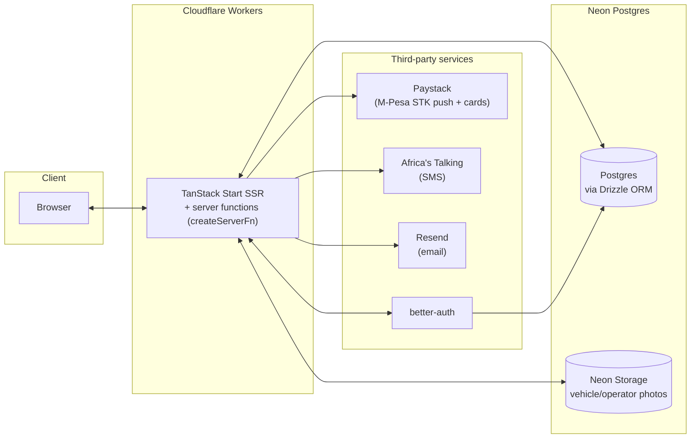

# DriveNest — End-to-End Roadmap

**Purpose of this doc**: a full inventory of what exists today, what's missing to make DriveNest an actual functioning two-sided marketplace (per the vision in [`idea.md`](idea.md)), and a phased plan to get there. Written 2026-09-06 against the state of `main` after the vehicle detail page landed.

---

## 1. Executive summary

DriveNest today is a **marketing and discovery front end** — a well-designed, on-brand shell with zero server-side logic behind it. Every "transactional" element you can see (search bar, date pickers, the booking CTA, payment mentions, "Become an Operator") is either static copy, a scroll anchor, or `useState` that resets on reload. The only real dynamic behavior anywhere in the app is client-side filtering of a hardcoded 16-row array on the browse page.

To become the marketplace `idea.md` describes — renters booking specific vehicles for specific dates and paying by M-Pesa/card, operators managing listings and getting paid — essentially everything below the page shells needs to be built: a database, auth, real search/availability, a booking flow, payments, an operator side, notifications, and legal pages.

This isn't a criticism of where the project is — it's exactly where a landing-page-first build should be. This doc exists to turn "everything" into an ordered, buildable sequence.

---

## 2. Current state — full inventory

| Area | Status | Notes |
|---|---|---|
| Server logic beyond SSR | **Absent** | `src/start.ts`/`src/server.ts` are pure SSR + CSRF/error-wrapper plumbing. No `createServerFn`, no API routes. |
| Auth / accounts | **Absent** | No library, no session concept, no user model anywhere. |
| Database / persistence | **Absent** | All "data" is `src/lib/fleet.ts` — a static TS array. Nothing survives a reload. |
| Payments (M-Pesa/card) | **Absent** | "M-Pesa & card" is marketing copy only. Detail page CTA literally says *"No payment now. Our team will confirm availability."* |
| Booking flow / submission | **Absent** | Zero `onSubmit`, `fetch()`, or `useMutation` calls anywhere in `src/routes` or `src/components`. |
| Date picker | **Installed, unused** | `react-day-picker` + shadcn `Calendar` exist but no route imports them. "Dates" fields are static text. |
| react-hook-form / zod | **Installed, unused** | Only referenced by the generic unused shadcn `form.tsx` primitive. |
| Browse page filters (category/seats/price) | **Works** | Real client-side `useMemo` filtering — the one genuinely wired piece of logic in the app. In-memory only. |
| Operator onboarding / dashboard / admin | **Absent** | "Become an Operator" is an anchor (`#operators`/`#support`) to a marketing blurb, not a route or form. |
| Notifications (SMS/email/WhatsApp) | **Absent** | Just a `mailto:hello@drivenest.ke` link and flavor-text copy ("Confirmation came instantly by SMS" in a testimonial). |
| Search/location/date UI | **Decorative** | Hero and browse-page search bars are static buttons with hardcoded placeholder text; Search button has no handler. |
| Reviews/ratings | **Static** | 3 hardcoded testimonials, fixed 5-star display, no per-vehicle rating data. |
| Legal/support pages | **Absent** | Footer says "Terms of Service · Privacy Policy" as **unlinked plain text**. No FAQ, no cancellation policy. |
| Testing | **Absent** | No test framework, no test files, no `test` script. |
| CI/CD | **Absent** | No `.github/workflows/`. |
| Deployment target | **Conflicting** | See §3 below — needs a decision, not just more building. |

---

## 3. Immediate housekeeping (before any backend work)

Two inconsistencies should be resolved first, because they'll bite as soon as real infrastructure (env vars, secrets, a database connection) enters the picture:

1. **Deployment target is declared three different ways.**
   - `vite.config.ts` (`nitro({ defaultPreset: "cloudflare-module" })`) and `README.md` ("Nitro, targeting Cloudflare Workers") agree: **Cloudflare Workers**.
   - `src/server.ts` exports a `fetch(request, env, ctx)` Worker entrypoint — matches the Cloudflare Workers module contract, not Netlify Functions.
   - `netlify.toml` and `idea.md`'s "Tech context" section still describe a **Netlify Functions** deploy.
   - **Read of the situation**: Cloudflare is the live, current target (three independent signals agree); Netlify is a stale leftover from an earlier decision. **Recommendation: remove `netlify.toml`, fix the line in `idea.md`, and treat Cloudflare Workers as the committed target** for everything that follows (this shapes the database driver and secrets-management choice below).

2. **`idea.md`'s "what's built" section is now slightly behind** — it predates the vehicle detail page (this session added `/vehicles/$slug`) but still correctly describes it as "groundwork that doesn't exist yet as a route." Worth a one-line update once this roadmap's Phase 1 lands, rather than now.

---

## 4. Recommended architecture

Given the confirmed Cloudflare Workers target, and that this environment already has a **Neon** MCP integration available:

**Why these specific choices** (all swappable — this is a recommendation, not a lock-in):

- **Neon Postgres + Drizzle ORM** — Neon's HTTP/serverless driver works natively from Cloudflare Workers (no TCP connection pooling problem, which rules out a traditional `pg` client here). Drizzle is lightweight, typesafe, and has a first-class Neon HTTP driver. Since this session already has Neon MCP tools wired up, provisioning a project/branch is a couple of tool calls away.
- **Neon branching for preview environments** — Neon's branch-per-PR pattern (copy-on-write DB branches) pairs naturally with Cloudflare's preview deployments, giving each PR an isolated database without extra infra.
- **better-auth** — self-hosted, has a Drizzle adapter, runs on Cloudflare Workers, and doesn't force a vendor relationship for something as core as user identity. Kenya-specific note: consider a phone-number/OTP flow (via Africa's Talking) as a first-class login method alongside email, since phone number is the more natural identifier for both renters and small operators here — email/password can still be the fastest path to a first working version.
- **Paystack over Stripe/raw Daraja** — Paystack supports both **M-Pesa STK push and card** under one Kenya-ready API, so the app integrates one provider instead of stitching Safaricom's Daraja API (M-Pesa only) and Stripe/another card processor (weaker Kenya card support) together. Direct Daraja integration remains an option later if M-Pesa transaction fees at Paystack's markup become a problem at scale.
- **Africa's Talking (SMS) + Resend (email)** — Africa's Talking is the standard Kenya-market SMS gateway (cheap, reliable local delivery); Resend for transactional email (booking confirmations, receipts) is simple to wire into a Worker.
- **Object storage**: either Cloudflare R2 (same platform as the Worker, zero egress fees) or Neon's storage buckets (keeps everything on one provider). Lean R2 if photo volume grows large; Neon storage is fine to start and keeps the stack to two providers (Neon + Cloudflare) instead of three.

---

## 5. Gap analysis against the stated vision

`idea.md` names five core value props. Here's what each actually requires, mapped to the phases below:

| Value prop | What's missing to deliver it |
|---|---|
| Transparent upfront KES pricing | Already true for the static catalogue — but needs to survive vehicles being operator-managed (Phase 1, 6) |
| Verified operators | Needs an operator entity + an approval/verification workflow (Phase 2, 6) — currently just a trust badge with nothing behind it |
| Two rental modes (self-drive / chauffeured) | UI toggle exists; needs to actually affect price/availability/booking (Phase 4) |
| Local payment rails (M-Pesa + card) | Fully unbuilt (Phase 5) |
| Marketplace breadth (multi-operator comparison) | Requires vehicles to belong to distinct operators in a DB, not one static list (Phase 1, 6) |

---

## 6. Phased implementation plan

Each phase is roughly sequential — later phases assume earlier ones exist — but Phases 6 and 7 can partially overlap with 4/5 once the data layer (Phase 1) and auth (Phase 2) exist.

### Phase 0 — Foundations (size: S)
- Resolve the Cloudflare/Netlify conflict (§3): delete `netlify.toml`, correct `idea.md`.
- Add `.env.example` documenting the secrets Phase 1+ will need (`DATABASE_URL`, auth secret, provider API keys) even before they're used, so the shape is visible in the repo.
- Set up secrets management: Cloudflare Workers secrets (`wrangler secret put`) for production, `.env`/`.dev.vars` for local dev.
- Add GitHub Actions CI: lint + typecheck + build on every PR (nothing to deploy yet, just catch breakage).

### Phase 1 — Real data layer (size: M)
- Provision a Neon Postgres project (main branch = production, a branch per PR/preview later).
- Drizzle schema: `operators`, `vehicles` (superset of today's `Vehicle` type, plus `operator_id`, `city`), `vehicle_images` (proper gallery table — replaces the `gallery?: string[]` stopgap added for the detail page).
- Seed script: migrate the 16 hardcoded vehicles into the DB under a placeholder "DriveNest Fleet" operator, so nothing regresses visually.
- Replace `fleet.ts` imports in `browse.tsx`/`index.tsx`/`vehicles.$slug.tsx` with a `createServerFn`-backed loader that queries Postgres. Keep `formatKes`/`getGalleryImages`-equivalent helpers, now operating on DB rows.
- **Outcome**: the exact same UI, now backed by a real, editable database instead of code you'd have to redeploy to change.

### Phase 2 — Accounts & auth (size: M)
- Add better-auth with the Drizzle adapter against the same Neon DB.
- Renter signup/login (email/password to start); session-aware header.
- `role` on the user (or a separate `operators` profile linked 1:1 to a user) distinguishing renter vs. operator vs. admin.
- A bare "My account" page as the first auth-gated route, proving the session plumbing end-to-end before anything depends on it.

### Phase 3 — Real search & availability (size: M)
- Add a `bookings` table (see Phase 4) — "available" becomes "no overlapping confirmed booking for the requested date range."
- Wire the homepage/browse date-range fields to the already-installed shadcn `Calendar`/`react-day-picker`.
- Make the Search button actually filter: location (match against the 6 served cities) × dates (availability) × existing category/seat/price filters (already working).

### Phase 4 — Booking flow (size: L) — the core transaction
- Vehicle detail page's static "Request to book" becomes a real form: date range, self-drive/chauffeured mode, quantity → computed total.
- `react-hook-form` + `zod` (already installed, currently unused) validate the form.
- Server function creates a `bookings` row (`status: pending`) after checking availability server-side (never trust the client's "it looked available" from Phase 3's read).
- Renter "My bookings" page listing reservations and status.
- **This alone — booking without payment yet, just a confirmed pending request plus a notification email — is a legitimate, shippable MVP slice.** It replaces "no payment now, our team will confirm" with an actual persisted request instead of a dead-end button.

### Phase 5 — Payments (size: L)
- Integrate Paystack: initiate charge (M-Pesa STK push or card) on booking confirmation.
- Webhook handler updates `bookings.status` → `confirmed` on successful payment, handles failure/timeout/cancellation.
- `payments` table: amount, method, provider reference, status — linked to a booking.
- Decide and implement the deposit-vs-full-payment policy `idea.md` gestures at ("no structure around deposits, refunds" is explicitly called out as today's market problem) — this is a product decision, not just an engineering one; flag it for the user before building.

### Phase 6 — Operator side (size: L)
- Operator dashboard: list their vehicles, add/edit vehicle (photos → R2/Neon storage, pricing, availability blocking).
- Operator verification workflow: admin approves an operator before their vehicles go live — this is what makes "verified operators" a real trust feature instead of a badge.
- Operator view of incoming bookings; mark fulfilled/cancelled.
- Payouts: start with a manual/admin-recorded payout entry; automated payout (e.g., M-Pesa B2C disbursement) is a reasonable later stretch goal, not part of the initial build.

### Phase 7 — Trust, notifications, content (size: M)
- Real reviews: tied to a completed booking (prevents fake reviews), rolls up into a per-vehicle/operator average rating.
- Transactional notifications: SMS (Africa's Talking) + email (Resend) for booking confirmation, payment receipt, pickup reminder.
- Legal pages: Terms of Service, Privacy Policy, Cancellation Policy, FAQ — and actually link them from the currently-unlinked footer text.
- Minimal admin panel: approve operators, moderate reviews, view all bookings/payments.

### Phase 8 — Hardening (size: M, ongoing)
- Testing: Vitest for logic (pricing calculation, availability-overlap logic — these are exactly the functions you don't want silently wrong), Playwright for the booking-flow E2E happy path.
- CI/CD: auto-deploy to Cloudflare on merge to `main`; preview deploy + a fresh Neon branch per PR.
- Error tracking (Sentry or similar) once real user traffic/transactions exist — silent failures in a payment flow are the worst kind.
- SEO pass now that vehicle data is dynamic: sitemap generation, structured data (schema.org `Product`/`Offer`) per vehicle.

---

## 7. Open decisions that need a person, not an engineer

Flagging these explicitly rather than picking silently, since they're product/business calls:

1. **Deposit vs. full payment upfront** at booking time (Phase 5).
2. **Commission model** — what DriveNest takes from each operator payout (affects the `payments`/payout schema design in Phase 5/6).
3. **Operator verification bar** — what "verified" actually requires (ID, insurance doc upload, physical vehicle inspection?) before Phase 6's approval workflow can be built with the right fields.
4. **Cancellation policy** — refund windows/penalties, needed before Phase 7's legal pages can say anything real.
5. **Auth identifier** — email-first (faster to build) vs. phone/OTP-first (more natural fit for the Kenya market per §4) for Phase 2.

---

## 8. Suggested starting point

Given everything above, the highest-leverage next slice is **Phase 0 + Phase 1 + a minimal Phase 4**, i.e.:

1. Fix the deployment conflict.
2. Stand up Neon + Drizzle, migrate the existing 16 vehicles in.
3. Make the vehicle detail page's booking CTA create a real (unpaid) booking request and send a confirmation email.

That turns the current "dead-end marketing site" into a real, if minimal, lead-capture funnel — before committing to the bigger, harder-to-reverse decisions (payment provider, commission model, operator verification) in later phases.
